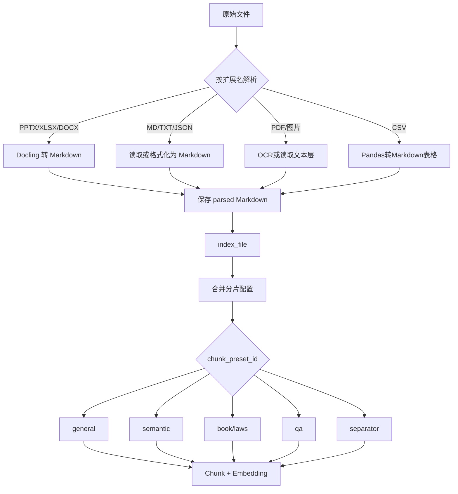

# 知识库分片配置指南

## 适用范围

本文说明 Milvus 知识库中文件解析、分片策略和索引配置的关系，重点覆盖 PPTX、Markdown、Excel、CSV、DOCX、PDF 和图片。

本文只描述当前实现，不提供按文件扩展名自动选择分片策略的机制。

## 核心结论

当前链路先把原始文件转换为 Markdown，再按 `chunk_preset_id` 对 Markdown 分片。



解析入口是 [`unified.py`](https://github.com/liaozd2025/agents-platform/blob/main/backend/package/yuxi/knowledge/parser/unified.py)，分片分派入口是 [`dispatcher.py`](https://github.com/liaozd2025/agents-platform/blob/main/backend/package/yuxi/knowledge/chunking/ragflow_like/dispatcher.py)。

因此，PPTX 和 XLSX 没有独立的“PPT 分片器”或“Excel 分片器”；它们先变成 Markdown，之后使用同一组分片策略。

## 文件类型推荐

| 文件类型 | 当前解析方式 | 推荐策略 | 适用条件与限制 |
| --- | --- | --- | --- |
| PPTX | Docling 转 Markdown | `general` 起步；内容密集时用 `semantic` | 当前没有 PPT 专用分片，不能仅靠策略保证一页一个 chunk |
| Markdown 技术文档 | 原样读取 | `semantic`；简单文档用 `general` | `semantic` 能识别标题、表格、代码、列表和图片说明 |
| Markdown FAQ | 原样读取 | `qa` | 标题或 `Q/A` 前缀会被抽取为问题和答案 |
| XLS/XLSX 普通表格 | Docling 转 Markdown | `semantic` | 适合多列数据和需要保留表头上下文的表格 |
| XLS/XLSX 两列问答表 | Docling 转 Markdown | `qa` | 第一列作为问题，第二列作为答案；不适合多列业务表 |
| CSV 普通数据 | Pandas 转 Markdown 表格 | `semantic` 或 `general` | 当前 CSV 会逐行转换为 Markdown 表格 |
| CSV 问答库 | Pandas 转 Markdown 表格 | `qa` | 适合问题列和答案列 |
| DOCX 手册或教材 | Docling，失败时回退到 python-docx | `book` 或 `semantic` | `book` 更偏章节层级合并 |
| DOCX 法规或制度 | Docling | `laws` | 会识别章节、条款和“第 X 条”结构 |
| PDF 或图片 | OCR 或读取 PDF 文本层 | `semantic`、`laws` 或 `general` | OCR 是解析配置，不是分片策略 |
| JSON | 格式化成代码块 | `general`；结构复杂时用 `semantic` | 不建议使用 `qa` |

### Excel 使用 `qa` 的限制

`qa` 不是通用 Excel 分片器。对 XLS/XLSX 表格，代码会把每行前两个单元格作为问题和答案：

```text
第一列 -> 问题
第二列 -> 回答
第三列及以后 -> 不应依赖
```

因此：

- `问题 | 答案` 两列表格可以使用 `qa`。
- `产品 | 规格 | 适应症 | 用法` 等多列表格应使用 `semantic`。

QA 处理逻辑见 [`qa.py`](https://github.com/liaozd2025/agents-platform/blob/main/backend/package/yuxi/knowledge/chunking/ragflow_like/parsers/qa.py)。

## 分片策略说明

| 策略 | 实际行为 | 适合内容 |
| --- | --- | --- |
| `general` | 按分隔符拆成段，再按 token 合并；默认 `chunk_token_num=512` | 普通 TXT、Markdown、PPT、普通文档 |
| `semantic` | 解析 Markdown 标题、表格、代码、列表、图片说明；超长内容可使用 Embedding 辅助切分 | 长 Markdown、PPT、Excel、复杂技术文档 |
| `book` | 删除目录、识别章节编号和层级，并进行层级合并 | 教材、书籍、操作手册 |
| `laws` | 识别章节、条款和法条层级；DOCX 会尝试标题树 | 法规、制度、合同、政策 |
| `qa` | 抽取问题和答案，统一输出 `问题：...\t回答：...` | FAQ、题库、产品标准 QA |
| `separator` | 命中分隔符立即切分，只有超长片段才继续按 token 拆分 | 已有稳定分隔符的文本 |

策略分派见 [`dispatcher.py`](https://github.com/liaozd2025/agents-platform/blob/main/backend/package/yuxi/knowledge/chunking/ragflow_like/dispatcher.py)，各策略实现位于 `backend/package/yuxi/knowledge/chunking/ragflow_like/parsers/`。

## 参数配置

### 配置结构

```json
{
  "chunk_preset_id": "semantic",
  "chunk_parser_config": {
    "chunk_token_num": 512,
    "overlapped_percent": 5,
    "delimiter": "\\n\\n"
  }
}
```

### 配置优先级

```text
请求参数 > 文件级 processing_params > 知识库 additional_params > general 默认值
```

同一层级的 `chunk_parser_config` 会进行深度合并。配置解析见 [`presets.py`](https://github.com/liaozd2025/agents-platform/blob/main/backend/package/yuxi/knowledge/chunking/ragflow_like/presets.py)。

### 参数是否生效

| 参数 | general | semantic | book/laws | separator | qa |
| --- | --- | --- | --- | --- | --- |
| `chunk_token_num` | 使用 | 使用 | 主要用于超长保护 | 使用 | 基本不使用 |
| `overlapped_percent` | 使用 | 不使用 | 仅部分路径使用 | 使用 | 不使用 |
| `delimiter` | 使用 | 不使用 | 部分路径使用 | 使用 | 后端不使用 |
| `embed_model_id` | 不需要 | 需要 | 不需要 | 不需要 | 不需要 |

Milvus 索引时会自动把系统 Embedding 模型注入 `semantic` 的配置，不需要手工填写 `embed_model_id`。索引代码见 [`milvus.py`](https://github.com/liaozd2025/agents-platform/blob/main/backend/package/yuxi/knowledge/implementations/milvus.py)。

前端目前会对多个策略显示 token、重叠比例和分隔符输入框，但最终以后端实际策略实现为准。

## 建议起始值

以下是用于首次验证的起点，不是所有文档的固定答案：

| 场景 | 起始配置 |
| --- | --- |
| 普通中文文档 | `general`，`chunk_token_num=512`，重叠 `0%` |
| 长 Markdown 或技术文档 | `semantic`，`chunk_token_num=400~600` |
| PPTX | `general`，`chunk_token_num=300~500`；内容跨页关联明显时改用 `semantic` |
| Excel 多列表格 | `semantic`，先保持较小 chunk，检查表头是否与数据同行保留 |
| FAQ 或产品 QA | `qa`，重点检查问题和答案抽取结果；不要依赖 token、重叠比例和分隔符 |
| 法规制度 | `laws`，通常不需要额外重叠 |
| 书籍手册 | `book`，先检查章节合并结果，再调整 token 上限 |
| 有稳定分隔符的文本 | `separator`，仅使用实际存在且语义稳定的分隔符 |

不要为了减少 chunk 数量直接把 token 上限调得很大。医学资料、法规和表格容易把多个主题合并进同一个向量。

## 操作顺序

1. 创建知识库时设置默认策略：按主要资料类型选择，例如普通文档选 `general`，法规库选 `laws`。
2. 混合文件时，在文件的“入库/重新入库”配置中覆盖单文件策略。
3. 只修改分片参数时，重新入库即可；索引阶段会读取已保存的 Markdown 并重新分片。
4. 修改 OCR 或文件解析方式时，重新解析，再重新入库。
5. 重新入库后确认文件状态为 `indexed`，并检查实际 chunk 内容和检索结果。

## 验收检查

至少检查以下结果：

- 文件状态为 `indexed`。
- 文件 `processing_params` 保存了本次实际使用的策略和参数。
- chunk 没有把标题、表头、问题和答案拆散。
- 使用测试文档中的唯一短语检索，召回来源是目标文件。
- 对 Excel 和 PPTX，打开解析后的 Markdown，确认上游转换结果已经保留需要的结构。

## 当前限制

1. 当前没有真正的 PPT 按页分片器。仅选择 `general` 或 `semantic` 不能保证一页一个 chunk。
2. Excel 的 `qa` 只适合两列问答表，不适合多列业务数据。
3. `semantic` 依赖 Embedding 模型；模型加载失败时实现会退化为简单切分，需要关注日志和实际 chunk。
4. `chunk_token_num` 使用仓库内的近似 token 计数，不等于具体 Embedding 模型的精确 tokenizer。
5. 修改分片策略不会自动改写已经索引的文件，必须重新入库并重新验证检索。

## 源码定位

- 文件格式解析：[`backend/package/yuxi/knowledge/parser/unified.py`](https://github.com/liaozd2025/agents-platform/blob/main/backend/package/yuxi/knowledge/parser/unified.py)
- 分片策略和配置合并：[`backend/package/yuxi/knowledge/chunking/ragflow_like/presets.py`](https://github.com/liaozd2025/agents-platform/blob/main/backend/package/yuxi/knowledge/chunking/ragflow_like/presets.py)
- 分片分派：[`backend/package/yuxi/knowledge/chunking/ragflow_like/dispatcher.py`](https://github.com/liaozd2025/agents-platform/blob/main/backend/package/yuxi/knowledge/chunking/ragflow_like/dispatcher.py)
- Milvus 索引入口：[`backend/package/yuxi/knowledge/implementations/milvus.py`](https://github.com/liaozd2025/agents-platform/blob/main/backend/package/yuxi/knowledge/implementations/milvus.py)
- 前端分片配置组件：[`web/src/components/ChunkParamsConfig.vue`](https://github.com/liaozd2025/agents-platform/blob/main/web/src/components/ChunkParamsConfig.vue)
