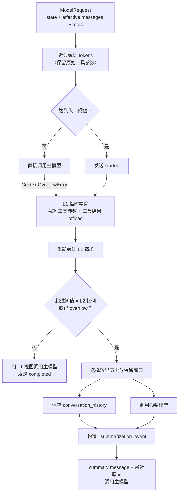

# Summary 上下文压缩机制

本页供 Agent 开发者和运维人员查询 Summary 的运行机制，范围包括上下文估算、L1 临时精简、L2 历史摘要、checkpoint 更新和流事件。配置字段见[智能体配置](../agents/agents-config.md)，中间件装配概览见[中间件系统](../agents/middleware.md)。页面内容以当前 `YuxiSummarizationMiddleware` 为准；尚未实现的简化方案不属于当前行为。

## 职责边界与两级处理

上下文压缩控制单次模型请求的有效消息规模。PostgreSQL 聊天记录保持原样，L1 也不会原地改写 LangGraph state。Yuxi 在 DeepAgents `SummarizationMiddleware` 上增加两级处理：

- L1 结构精简：只为当前主模型请求构建临时消息视图，截短视图内 `write_file`/`edit_file` 的大参数，并把超过阈值的 `ToolMessage` 完整内容写入 `outputs/large_tool_results`，消息中保留路径与预览。
- L2 语义摘要：当 L1 后仍超过二级门槛，选择较早历史，写入 `outputs/conversation_history`，调用同一模型生成 summary message，并通过 LangGraph state event 让后续调用重建有效消息。

入口阈值未达到时，中间件直接调用主模型，不运行 L1，也不发送压缩事件。主模型抛出 `ContextOverflowError` 时，中间件将该异常作为强制压缩信号，随后执行 L1 并按条件进入 L2。两级处理均作用于模型请求视图；只有 L2 通过 `Command(update=...)` 写入新的 checkpoint state。

## 装配位置与请求流程

主 Agent 和 SubAgent 在 graph 构建阶段读取 Context 中的 Summary 字段，并使用当前主模型创建 `YuxiSummarizationMiddleware`。Summary 位于文件系统、附件和 Skills 中间件之后，可以通过 runtime context 获取组合文件后端，并将历史和长工具结果写入当前 Agent 可见的 `outputs`。主 Agent 配置 task middleware 时，task 也排在 Summary 之前。

同步路径先保存历史，再调用摘要模型；异步路径通过 `asyncio.gather` 并发执行两项操作。主模型响应成功后，两条路径都通过 `Command(update=...)` 返回 `_summarization_event`。历史文件写入与摘要生成相互独立：写入失败会记录 warning，摘要调用仍会继续。

## L1：临时结构精简

L1 根据 LangGraph state 和已有 `_summarization_event` 重建有效消息，并为本次模型调用生成独立副本。精简包含两类动作：

- 有效消息视图中的 `write_file`、`edit_file` 调用参数超过 2,000 字符时，副本只保留截断标记。该规则遍历全部匹配调用，不保留近期调用窗口。2,000 字符是中间件内部常量，Agent 配置不提供对应字段。
- 对估算 token 数超过 `summary_tool_result_token_limit` 的 `ToolMessage`，把完整文本写入 `outputs/large_tool_results/<tool>-<内容哈希>.txt`，再用文件路径和同一 token 预算下的预览替换请求副本中的正文。已经带有保存标记的消息不会重复写入。

文件名使用原内容的 SHA-256 摘要，因此相同内容对应稳定路径。token 估算采用近似字符比例，只用于触发和裁剪；模型供应商返回的 usage 才是计费依据。L1 结果未达到 L2 门槛时，主模型直接使用临时视图，state 中的原始消息保持不变。

## L2：历史摘要与状态

L2 门槛等于入口阈值乘以 `summary_l2_trigger_ratio`。L1 后的估算值严格超过该门槛，或当前请求已经发生 `ContextOverflowError` 时，中间件进入语义摘要。它从较早消息中选择待摘要区间，并优先保留最近 `summary_keep_messages` 条消息。保留窗口仍超过上下文容量时，中间件继续裁剪本次发送的尾部视图；持久化消息不受影响。

中间件尝试将选中的历史写入 `outputs/conversation_history`，文件名由 DeepAgents 生成；摘要模型同时根据清洗后的历史生成一条 summary message。`_summarization_event` 记录累计 cutoff、摘要消息和成功写入后的历史文件路径。后续请求使用“最新摘要 + cutoff 之后的原始消息”重建有效上下文，从而跳过已经摘要的区间。

cutoff 表示完整 state 中的累计位置。已有摘要再次触发压缩时，中间件把新的局部 cutoff 换算为全局位置。L2 通过 LangGraph `Command(update=...)` 更新当前 run 的 checkpoint state，PostgreSQL 中已有的聊天消息保持不变。

## 流事件与前端可见性

LangGraph custom event 暴露一轮压缩的三个阶段：`started`、`completed` 和 `failed`。达到入口阈值时，中间件在 L1 前发送 `started`。低于阈值且由 overflow 强制进入的路径，会在实际开始保存 L2 历史时发送 `started`。L1 或 L2 处理后的主模型调用成功时发送 `completed`；压缩已经开始且出现未处理异常时发送 `failed`。仅完成 L1 的 `completed` 不包含 L2 cutoff 或历史文件路径，消费者应据此识别压缩层级。

`chat_service` 将 custom event 映射为 SSE `context_compression` 事件，供前端展示压缩进度和失败状态。SSE 只承担实时通知。L2 的可复用状态以对应 run 的 checkpoint 为准，历史文件以所属文件系统中返回路径的读取结果为准。

L2 内部摘要模型调用带有 `TAG_NOSTREAM`，流处理层不会将摘要 token 发布为面向用户的 assistant 输出。token usage 中间件当前只归集主模型调用，内部摘要调用不计入对话主模型用量。

## 配置语义

以下字段来自 Agent Context。主 Agent 与 SubAgent 共享字段语义，配置元数据将修改权限限定为管理员：

| 字段 | 默认值 | 当前语义 |
| --- | ---: | --- |
| `summary_threshold` | `100` | 入口阈值，单位 K；装配时乘以 1,024 得到 token 阈值 |
| `summary_keep_messages` | `10` | L2 后除 summary message 外优先保留的最近消息数量 |
| `summary_prompt` | 内置中文模板 | 摘要模型提示词，必须包含 `{messages}` 占位符 |
| `summary_tool_result_token_limit` | `300` | L1 判断长工具结果和生成预览时使用的近似 token 上限 |
| `summary_l2_trigger_ratio` | `0.4` | L1 后触发 L2 的入口阈值比例；建议范围为 `0.1` 到 `1.0` |

配置页中的“摘要触发”表示请求进入 Yuxi 压缩流程，实际处理结果可能停在 L1。降低 L2 比例会提前触发语义摘要，增加保留消息数会扩大摘要后的请求体。调整参数时需要同时验证目标模型的上下文窗口和典型工具输出规模。

## 文件、隔离与 token 口径

长工具结果和会话历史通过当前 runtime context 的组合文件后端写入虚拟 `outputs`。长工具结果位于 `outputs/large_tool_results`，会话历史位于 `outputs/conversation_history`。主 Agent 使用当前线程的文件作用域；SubAgent 继承父线程的文件作用域，因此两者的产物都能从同一会话文件空间读取。路径解析、可写范围和沙盒承载关系见[沙盒机制](sandbox.md)。

这些文件可能包含完整工具返回或旧对话，安全级别与用户内容相同。文件路径必须经过所属文件系统边界校验；公共 Skills 区禁止写入，宿主机路径禁止暴露给模型。长工具结果文件名使用内容哈希，提供稳定寻址并减少标题信息泄漏；历史文件名由 DeepAgents 生成。文件命名过程不执行内容脱敏或加密。

压缩阈值使用本地近似计数，system message 与工具 schema 一并计入请求预算。模型供应商返回的 usage 是计费与用量依据。当前 token usage 只记录主模型调用，内部摘要模型消耗尚未纳入该口径；成本核算需要单独记录这项缺口。

## 失败、恢复与观察边界

- 历史文件写入失败时，中间件记录 error 和 warning，并继续用生成的 summary 调用主模型；event 的 `file_path` 为 `None`，被摘要的旧消息无法再通过文件恢复。
- 摘要模型异常会生成带错误文本的 summary message，不会直接向外抛出。主模型随后仍可能成功，压缩事件也可能显示 `completed`；运维判断需要同时核对 summary 内容和日志。
- 无法选出有效 cutoff 时退回 L1 视图；若该视图仍触发模型 overflow，异常继续向外传播并产生 `failed` 事件。
- overflow 下对保留尾部的额外裁剪会作为 state message update 返回，用于使后续 checkpoint 与实际有效尾部一致；它仍不删除 PostgreSQL 聊天记录。
- custom event、warning 和 HTTP 成功提供过程信号。可恢复摘要以 checkpoint 中的 `_summarization_event` 为准，可恢复原文以所属文件系统中的历史文件为准，用户可见回复以绑定同一 request/run 的最终输出为准。

排查时先定位同一 request/run 的 SSE 事件，再核对 checkpoint event、虚拟文件和主模型错误。相邻 run 的摘要文件和消息不构成本次结果证据。

## 源码定位与验证

| 要确认的事实 | 语义 Owner |
| --- | --- |
| 默认值、字段权限与配置说明 | [agents/context.py](https://github.com/xerrors/Yuxi/blob/main/backend/package/yuxi/agents/context.py) |
| L1/L2 判断、文件写入、event 与 state update | [middlewares/summary.py](https://github.com/xerrors/Yuxi/blob/main/backend/package/yuxi/agents/middlewares/summary.py) |
| 主 Agent 装配顺序 | [chatbot/graph.py](https://github.com/xerrors/Yuxi/blob/main/backend/package/yuxi/agents/buildin/chatbot/graph.py) |
| SubAgent 装配与作用域 | [subagent/graph.py](https://github.com/xerrors/Yuxi/blob/main/backend/package/yuxi/agents/buildin/subagent/graph.py) |
| custom event 到 SSE 的映射 | [chat_service.py](https://github.com/xerrors/Yuxi/blob/main/backend/package/yuxi/services/chat_service.py) |
| 主模型 token usage 口径 | [token_usage.py](https://github.com/xerrors/Yuxi/blob/main/backend/package/yuxi/agents/middlewares/token_usage.py) |

修改该机制时，至少运行 Summary middleware 与 graph config unit。流事件或用量口径变化还需运行 chat service、token usage unit；真实模型兼容性变化需运行 `backend/test/integration/services/test_summary_middleware_real_model.py`，并记录模型与凭据环境。验证场景包括低于入口阈值、仅 L1、进入 L2、history 写入失败、摘要模型异常和 overflow 尾部裁剪；oracle 需要核对消息视图、state update、文件或协议结果。
