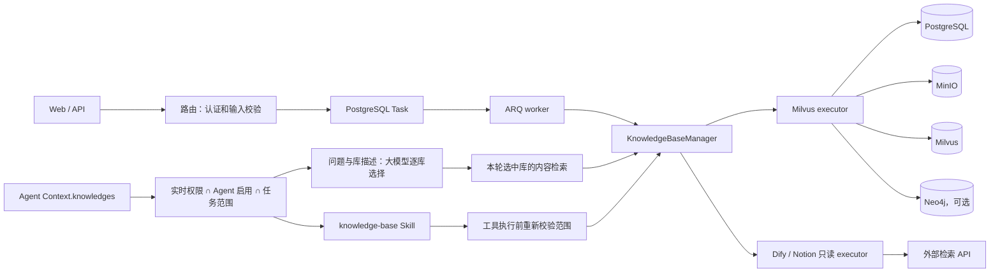
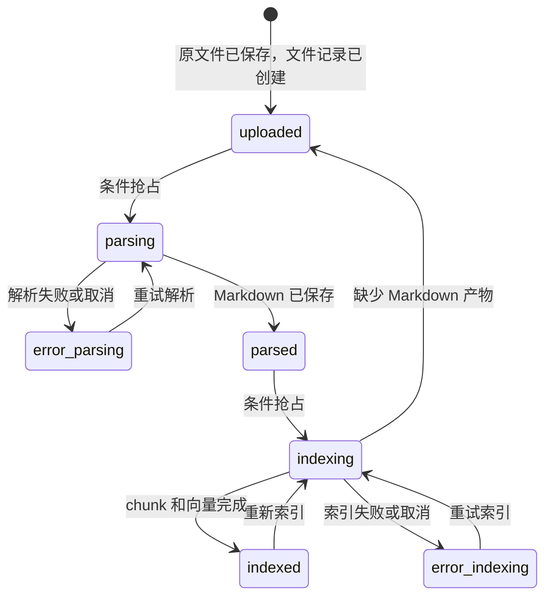

# 知识库机制

本页说明文档怎样从上传走到可检索状态，以及 PostgreSQL、MinIO、Milvus、Neo4j、Durable Task 和 Agent 工具各自负责什么。第一次操作知识库请看[创建并使用知识库](../intro/knowledge-base.md)，解析器配置见[文档处理与 OCR](../advanced/document-processing.md)。

## 能力边界

Yuxi 通过 `KnowledgeBaseManager` 读取知识库配置、解析权限并选择 executor：

- `milvus` 是文档型知识库，支持上传、解析、分块、向量索引、预览和检索，也可以构建知识图谱；
- `dify` 和 `notion` 是只读连接器，只保存外部连接信息并执行 Query，不承载 Yuxi 的上传、解析、索引、文件树和全文预览。

前端按钮只反映 executor 的能力，最终判断由后端完成。只读连接器收到不支持的操作时会明确报错。

## 两条链路

管理链路改变知识库事实，Agent 链路消费当前用户和当前 Agent 可见的知识库：



路由只接收请求并提交任务；Manager 负责配置和 executor 选择；具体 executor 负责解析、索引和检索。知识库配置的最终值在 PostgreSQL，Redis 只缓存最小运行配置，未命中或异常时回源数据库。

## 文档状态机

上传、解析和索引是三个可以分别观察的动作：



历史 `failed`、`done` 状态只作为兼容输入。`parsing` 和 `indexing` 表示当前动作已经抢到执行权；没有抢到允许状态的并发请求会失败，同一文件不会由两个动作同时推进。

- `uploaded`：原文件和文件记录存在，尚未完成解析；
- `parsed`：解析后的 Markdown 路径已写入文件记录；
- `indexed`：本次分块、向量写入和统计更新已完成；
- `error_parsing`、`error_indexing`：对应阶段失败或取消，并保存错误信息。

任务接口的响应和 Durable Task 状态只表示编排结果。验收时重新读取文件状态，并按需核对 Markdown、chunk、向量和图谱数据。

## 各存储负责什么

| 存储 | 拥有的事实 | 不拥有的事实 |
| --- | --- | --- |
| PostgreSQL | 知识库配置、权限、文件元数据和状态、chunk 正文、图谱处理状态、Task 执行意图与 lease | 原文件字节、向量索引 |
| MinIO | 上传原件、解析 Markdown、解析图片 | 文件当前状态、用户权限 |
| Milvus | chunk 向量、BM25/混合检索字段、图实体和关系向量 | 权限、文件状态 |
| Neo4j | 可选的实体、关系和 chunk 关联 | 原文件、权限和检索排序 |
| Redis / ARQ | Task 投递与 worker 唤醒、知识库最小运行配置缓存 | Task 最终状态、配置最终值、文件状态 |

Milvus 索引会把 chunk 写入 PostgreSQL 和 Milvus。它不是跨存储事务：任一侧失败时会尝试补偿并把文件置为 `error_indexing`，排查时需要同时查看两侧。

## Durable Task 和恢复

上传原文件是同步对象存储操作；批量添加、解析、索引和图谱构建把 `task_type`、Handler 版本和可序列化 payload 保存到 PostgreSQL。提交后 API 只发布 `task_id`，ARQ worker 从 registry 加载领域 Handler。

worker 用唯一 attempt token claim Task 并续租 lease；重复投递和失权 worker 的迟到写入会被 PostgreSQL 拒绝。首次发布失败时，pending Task 保留，启动和周期 publisher 会补发。所有 Durable Task 在 owner 中断或 lease 过期后都会明确失败，不自动重放未知外部副作用。

批量“待解析”和“待入库”入口按状态筛选文件，并通过数据库 dedupe key 拒绝活跃重复任务。取消运行中任务时先保存 `cancel_requested`，由 worker 在控制点收敛。重试前保留故障现场，检查文件记录、MinIO、chunk、Milvus 和 Neo4j，再选择重新解析、重新索引或图谱修复。

## Agent 如何看到知识库

聊天服务在内容检索前读取用户有权访问、Agent 已启用的知识库目录。选库模型结合当前问题、必要历史和各库名称、描述逐库判断，可以选择零个、一个或多个库；问题所属类别不构成跳过依据。缺少描述时按库名判断，并在运行结果中标记缺失、提示补充；有影响回答的歧义时简短追问。模型或协议错误显式记录，不能退回全库检索。

任务明确允许的库与本轮选中的库分别保存。明确范围延续到当前任务的追问，切换新任务重新判断；只限定范围不等于每轮强制查询。子任务继承父运行的有效硬范围并与自己的配置取交集。工具每次执行时重新读取权限，再与 Agent 启用、任务范围及本轮选择取交集；中途撤权后不能沿用旧快照访问。

知识库工具由内置 `knowledge-base` Skill 提供。模型读取该 Skill 的 `SKILL.md` 后，才会看到：

```text
list_kbs、select_kbs、query_kb、find_kb_document、open_kb_document、
get_mindmap、search_file、download_kb_file
```

工具沿用本轮选库结果。任务出现新的事实需求时，`select_kbs` 在任务允许范围内重新按描述选择；已有证据足够时直接使用，避免重复查询。内容检索后可以用 `file_id` 打开或定位原文；`download_kb_file` 将有权访问的原始二进制写入当前 Project 的 `outputs`。知识库不会映射为 `/home/gem/kbs` 沙盒目录。

PostgreSQL 的 Run 保存本轮选择、逐库理由、错误和有效范围，Conversation 保存同一任务延续的范围。选中某库只表示预计能补充信息，不保证有命中，也不意味着最终回答采用；最终引用仍须对应实际使用的资料。审批恢复读取被恢复运行保存的范围，不能从相邻运行猜测。

## 权限

知识库的最终授权由后端依赖、Manager 可见性查询和具体工具目标校验共同完成：

- 读取、检索、打开和下载需要 read 权限；
- 创建、更新、添加文件、解析、索引、删除和图谱写操作需要 manage 权限；
- 原文件上传入口要求管理员，并在传入 `kb_id` 时继续检查该知识库的 manage 权限；
- 前端守卫、按钮隐藏、Agent 配置和提示词只控制呈现或缩小范围，不能授予权限。

Agent 的 `knowledges` 只能缩小用户已有权限。子智能体沿用发起用户的身份，同时受父运行有效知识库范围约束。私有解析图片通过带知识库权限校验的 API 读取，MinIO 对象 URL 不是授权凭证。

## 失败和重试

- 解析失败或取消：文件进入 `error_parsing`，查看错误并重新提交解析；批量待解析入口只扫描 `uploaded`。
- 索引失败或取消：文件进入 `error_indexing`，检查分块、嵌入和存储后重新入库；批量待入库入口扫描 `parsed` 和 `error_indexing`。
- 索引缺少 Markdown：文件回到 `uploaded`，必须重新解析，不会生成空索引。
- Durable Task 失败、取消或 lease 过期：只能说明后台动作未完成，不能推断外部存储没有部分写入；知识任务不会在未知副作用上自动重放。
- Redis 缓存异常：Manager 回源 PostgreSQL；不支持的知识库类型或 executor 初始化失败会明确阻止操作。
- 选库模型失败、非法响应或内容检索失败：记录失败，不能作为“未找到资料”继续声称检索成功；合法空结果才表示没有命中。外部 Dify、Notion 查询失败会向调用者传递错误。

## 源码定位与验证

- [描述选库策略](https://github.com/liaozd2025/agents-platform/blob/main/backend/package/yuxi/services/knowledge_retrieval_policy.py)：逐库选择、模型输出校验与检索错误语义
- [聊天服务](https://github.com/liaozd2025/agents-platform/blob/main/backend/package/yuxi/services/chat_service.py)：任务上下文、运行审计与范围持久化
- [描述选库 E2E](https://github.com/liaozd2025/agents-platform/blob/main/backend/test/e2e/test_knowledge_description_routing_e2e.py)：真实 HTTP、worker、PostgreSQL 与受控模型/检索协议的范围回读；不代表外部模型语义准确率
- [知识库路由](https://github.com/xerrors/Yuxi/blob/main/backend/server/routers/knowledge_router.py)：权限、上传、任务和状态筛选
- [KnowledgeBaseManager](https://github.com/xerrors/Yuxi/blob/main/backend/package/yuxi/knowledge/manager.py)：配置回源、可见性和 executor 调度
- [知识库基类](https://github.com/xerrors/Yuxi/blob/main/backend/package/yuxi/knowledge/base.py)：文件状态和解析流程
- [Milvus executor](https://github.com/xerrors/Yuxi/blob/main/backend/package/yuxi/knowledge/implementations/milvus.py)：分块、双写、检索和重索引
- [只读连接器](https://github.com/xerrors/Yuxi/blob/main/backend/package/yuxi/knowledge/implementations/read_only_connectors.py)：Dify/Notion 能力边界
- [Durable Task runtime](https://github.com/xerrors/Yuxi/blob/main/backend/package/yuxi/services/task_service.py)：任务持久化、claim、lease 和恢复结局
- [Task Handler registry](https://github.com/xerrors/Yuxi/blob/main/backend/package/yuxi/services/task_registry.py)：领域 Handler 注册和惰性加载
- [知识库工具](https://github.com/xerrors/Yuxi/blob/main/backend/package/yuxi/agents/toolkits/kbs/tools.py)：Agent 目标校验和工具实现
- [知识库 unit tests](https://github.com/xerrors/Yuxi/tree/main/backend/test/unit/knowledge)
- [权限与路由 tests](https://github.com/xerrors/Yuxi/tree/main/backend/test/unit/routers)
- [知识库 HTTP integration](https://github.com/xerrors/Yuxi/blob/main/backend/test/integration/api/test_knowledge_router.py)
- [外部知识库 integration](https://github.com/xerrors/Yuxi/blob/main/backend/test/integration/api/test_knowledge_external_router.py)

修改状态、权限、存储或 Agent 工具链路时，至少运行对应 unit 和真实 HTTP integration；涉及外部存储时，从 PostgreSQL、MinIO、Milvus 或 Neo4j 回读最终结果。
