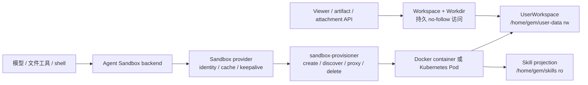

# 沙盒与文件系统机制

本页解释 Agent 的文件和命令如何进入动态沙盒，以及 UserWorkspace、Project Workdir、Skills、Viewer 和 provisioner 的关系。部署参数见[沙盒配置与运维](../agents/sandbox-architecture.md)。

## 一句话理解

Yuxi 让多个访问入口看到同一份持久文件，但给它们不同的访问能力：

- Agent 通过带认证的 provisioner 代理访问动态 Sandbox；
- Viewer、附件和 artifact API 直接访问 UserWorkspace 的持久文件；
- 知识库通过知识库工具访问，不挂载为沙盒目录。

模型和产品接口只使用虚拟路径。宿主机路径、容器路径和对象存储 URL 不能混用；每个文件入口都在所属文件系统边界内校验路径、用户和权限。

## 运行链路

Graph 创建时，Agent backend 取得 `uid`、根运行 scope 和 `workdir_path`，并同步获授权的 Skill 投影。普通聊天与恢复直接进入模型；只有 PI 工具执行或 backend 实际访问文件时才创建沙盒。PI 首次使用保留容量不足时的有界等待与取消；直接文件操作在容量不足时报告 `sandbox_capacity_exhausted`，由调用方处理失败。API/worker 只持有 provisioner 代理地址，不直接访问动态容器或 NodePort。

## Identity、Workdir 和生命周期

`runtime_scope_id` 是一次顶层执行树的沙盒分组键，当前使用根 Conversation 的 thread ID。根 Agent 和子 Agent 共享这个 scope，因此可以共享同一个运行时、`/tmp`、环境和文件挂载；子 Agent 的 child thread 只隔离 LangGraph checkpoint。

Conversation 通过 `project_id` 绑定 Project；Project 拥有这项绑定和 `workdir_path`，UserWorkspace 拥有该路径下的实际文件字节。`workdir_path` 是当前用户 UserWorkspace 下的合法相对 POSIX 路径，例如 `projects/<uuid>`，不能包含 `..`、反斜杠或符号链接。`linked` Project 只能引用已经存在的目录，目标不存在时请求失败；`managed` Project 使用服务分配并物化的 `projects/<uuid>` 目录，目录创建失败时请求失败。Workdir 决定当前工作目录和 Viewer 文件范围，但不决定 sandbox identity，也不把同一用户的其他 Project 变成安全隔离边界。两个顶层 Conversation 即使绑定同一 Workdir，也会创建不同 runtime。

| 运行类型 | checkpoint | runtime scope | Workdir |
| --- | --- | --- | --- |
| 普通 Agent | 当前 thread | 根 thread | 当前 Project 的 Workdir |
| 子 Agent | child thread | 根 thread | 继承根 Conversation |
| PI 沙箱任务 | attempt 内的 PI session | 根 thread | 继承根 Conversation |
| 远程 Skill 安装 | 临时 thread | 临时 thread | 无持久用户目录，`inherit_env=False` |

`uid + runtime_scope_id` 派生稳定 `sandbox_id`。同一 runtime 存活期间不能改绑到另一个 Workdir。根执行树终态后，worker 清理 runtime，但保留 UserWorkspace 文件。

## PI 任务的交付与持续协作

`pi_sandbox` 在现有 Request、child Run 和 Attempt 中执行 PI Runner。命令的 cwd 是当前 Project；依赖和中间文件保留在工作目录，最终交付通过 `submit_artifact` 显式登记在当前 attempt 的 `outputs/pi-runs/<目录>/`。登记和 final ACK 都验证文件类型、路径、大小和摘要；单文件上限 64MiB，总量 256MiB，最多 200 个文件。只读任务可以没有交付物。artifact、session、patch 和最终消息始终绑定同一 attempt；patch 描述该次已登记交付，不是任意项目源码改动的回滚包。

主智能体负责用户沟通、知识检索、MCP、阶段安排和最终业务验收，把真实路径、来源、约束及完成标准交给 PI。同一执行者、输入齐备、权限一致且验收目标连续的工作组成一个阶段；PI 在阶段内连续检查输入、执行和核验。缺少业务口径、用户决策或主图工具结果时，PI 交回主图，再按剩余工作续接。Skill 的步骤可以跨多个执行者，读取 Skill 不会把主图的 MCP 工具授予 PI。例如报表流程由 PI 取数计算，主图调用 Charts，必要时 PI 再装配文件。

多步文档任务先用 `write_todos` 展示计划。文档验收方式由适用 Skill 和本次要求决定；PI 复用已验证映射，批量加工副本并保存关键内容与核验文本，涉及版式要求时按要求检查。主图读取已知文本路径核对原文、来源和需求，发现具体缺项才追加委派；完成后直接交付已登记原路径，未完成的验收如实说明。报表核对时间范围、指标口径、真实行数、截断标志与关键合计，展示子集不能代替完整数据。

PI 通过 `submit_artifact` 登记文件和阶段结论，也可不传文件路径，只返回 `stage_status`（`completed`、`needs_input` 或 `failed`）、`checks` 与 `unresolved_items`。缺输入和失败阶段保留 session 与中间文件，正式 `artifact.files` 为空。Run 的 `completed` 表示执行结果已确认；主图仍负责业务验收。旧结果没有阶段字段时明确显示未报告，不据此推断业务成功。正常交回缺输入的已 ACK 会话可以在用户补齐后续接；超时或执行未知的失败会话不满足这个续接条件。

用户持久化文本直接经过 Workspace 的 no-follow 边界读取，无需启动沙箱；单次读取沿用 `MAX_BINARY_BYTES` 预览上限，超限交给 PI 提取。分页使用一致的 Unicode 行定义，只在确有后续内容时提示续读。已有附件 parser 和授权知识库文件下载由平台工具直接执行；`html-preview` 等回答规则由主图应用。动态读取共享 Skill 文件走 sandbox backend，可能建立沙箱连接；预加载 Skill 文本由后端读取。

工具返回包含本次 PI Run 标识及实际续接来源，供后续修正选择。新委派省略 `source_run_id` 时使用新上下文；同阶段修正填写原 PI Run 标识。来源须属于相同用户、Project 和 PI child 会话，在当前 child 创建前完成并 ACK。指定来源无效时明确失败。兼容输入 `continue_session=true` 单独出现时选择符合上述条件的最近成功 PI；同时填写来源时以明确来源为准，false 与来源同时出现则拒绝。重放复用原 child，已有 attempt 的来源保持不变。

repository 选定来源后，Workdir 有界读取并验证 session 摘要，Runner 从字节快照 fork 新 session，旧文件保持不变。每次委派仍启动新的 PI 进程，同根执行范围复用沙箱，根执行树结束后清理沙箱。Project 根 `AGENTS.md` 与获授权 Skill 路径显式投影；Runner 不自动加载工作目录中的其他 Skill、扩展或系统提示文件。模型上下文、输出上限、输入模态及 reasoning 能力来自现有逐模型配置；child Run 用量只统计本次执行，未上报时显示未知。

正文增量和工具累计输出经 Redis SSE 展示，约每 250ms 合并；工具完成事件覆盖中间快照。这些高频事件校验当前 attempt 与 lease，但不追加 PostgreSQL 历史。数据库保留工具首尾和 final ACK，PI 详情从真实 child Run 回读状态及用量，不依赖 LangGraph checkpoint。

worker 的 `PI timing` 日志按 Run/attempt 记录登记、容器准备、runtime inspect、结果接收与持久化、清理耗时；`PI stream` 记录输出轮询次数、轮询 API 调用次数（不含 SDK 内部重试）、空输出轮询与传输字节。Runner 的 `pi_started.timings_ms` 记录 SDK 加载、模型配置、资源和历史加载及首个模型请求前耗时。runtime inspect 只读取并校验版本、Runner 和 Skill 文件，实际任务启动时才加载 SDK。主任务耗时包含 PI 子任务，统计总时长时不重复相加。

运行中引导沿用根会话的 Request 队列。服务端确认当前执行树存在待处理的 steer 后，仅发送固定让位控制行；PI 完成当前整个工具批次并确认控制后，以 `stop_reason=steer` 和待主图处理的阶段结果让位，下一 Request 再执行新要求。当前 PI 不直接接收并执行那段新要求。取消会等待已启动执行停止再清理；启动响应或停止确认失败会保留可观察的清理失败事实。任务审批沿用既有授权范围，包含沙箱命令及当前用户工作区访问，不提供逐命令审批。显式 `default` 审批模式下，普通子图请求 PI 在创建和 worker 执行入口被拒绝，需交回具有审批路径的主图；`always_trust` 沿用已有授权。

沙盒 PTY 的 `no_change_timeout` 只表示输出观察暂停；平台继续轮询捕获文件，以包装命令的退出码文件确认完成，并在自身执行期限到达时停止进程。同一 runtime scope 的活跃 PI 在创建事务中串行约束；新模型上下文不会隔离共享文件。执行树已有 `execution_unknown`、`worker_lease_expired`、`sandbox_parent_unavailable`、`cleanup_failed` 或 `result_persistence_failed` 时拒绝新的 PI 委派，普通子图和合法 resume 不能绕过，幂等调用仍返回原任务；新的独立 chat 不永久继承旧执行树的失败。

Runner 的模型 `error` 或 `aborted` 不生成成功 final，即使此前已收到部分正文。确认进程退出后的模型失败记录为 `model_failed`；持久化前将文本 NUL 转为可见表示并以处理后的 payload 计算摘要。确定性入库拒绝记录 `result_persistence_failed`，传输或 ACK 不确定才保留 `execution_unknown`；清理失败单独保留。恢复前先核对状态与已落盘成果，不无条件重做整项任务。

## 挂载和文件 Owner

| 虚拟路径 | 内容 | Agent 权限 |
| --- | --- | --- |
| `/home/gem/user-data` | 当前用户的整个 UserWorkspace | 读写 |
| `/home/gem/skills` | 当前用户已授权的共享/内置 Skill 投影 | 只读 |
| `/home/gem/user-data/<workdir_path>` | 当前 Project 的工作目录 | 默认 cwd |

`uploads/` 和 `outputs/` 在首次使用时创建。个人 Skill 位于 `/home/gem/user-data/agents/skills/<slug>`，不会复制到共享 projection。

同一用户的 Sandbox 能看到整个 UserWorkspace，所以 Project A 可以读取 Project B。系统提示词要求 Agent 未经用户明确要求不要在当前 Workdir 外写入，但这只是行为约束，不是安全隔离；真正的边界由用户挂载、Workdir ownership 查询和工具路径校验提供。

文件访问使用相对路径和 no-follow 原语，拒绝 `..`、符号链接、特殊文件和跨用户根目录。普通运行服务以 `1000:1000` 访问数据；storage migrator 只在停机迁移中承担一次性 root 文件操作。

## Docker 和 Kubernetes

Docker backend 为每个 runtime 创建独立 bridge 网络，不发布沙盒端口，也不加入应用 `app-network`。网络只连接 provisioner 和对应沙盒，因此沙盒不能互访，也不能直接访问 PostgreSQL、Redis、MinIO、Milvus 或 Neo4j。provisioner 复用实例前会检查 uid、Workdir、挂载和网络身份。

Kubernetes backend 创建 Pod 和 NodePort Service。Pod 从 User Data PVC 的 `shared/<uid>/workspace` 挂载 `/home/gem/user-data`，从 Skill PVC 的 `skill-projections/<uid>` 只读挂载 `/home/gem/skills`。Pod 默认不自动挂载 ServiceAccount token；具体安全性仍取决于 namespace、PVC、NetworkPolicy 和 ServiceAccount 配置。

`memory` backend 只记录 ID 到 URL 的映射，不创建隔离环境或准备持久目录，不能作为生产隔离承诺。

## 环境变量和信任边界

API/worker 使用 `SANDBOX_PROVISIONER_TOKEN` 调用 provisioner。动态沙盒会收到全局 `sandbox.env` 与当前用户 Agent 环境的合并值，用户值覆盖同名全局值；这些值都可能被沙盒内代码读取和外传。provisioner token、平台数据库凭据、对象存储管理凭据和云平台管理员密钥不能进入这两类环境。报表所需业务数据库连接使用仅能读取获授权库表的专用账号，不授予写入、文件操作或管理权限；Skill 的 SQL 检查只是辅助，不能替代数据库授权。

远程 Skill 安装使用不继承环境变量的一次性 Sandbox，也不挂载持久用户根。Skill 文件是只读的，但其中脚本仍可能被执行；脚本如需写文件，应写入当前 Project Workdir 或 User Data。

## 失败、恢复和观察边界

| 现象 | 能证明什么 | 不能证明什么 |
| --- | --- | --- |
| provisioner `/health` 正常 | 进程和 backend 已初始化 | 某个 runtime 已创建、挂载或权限正确 |
| create/discover 返回代理 URL | 找到 identity 匹配的实例 | Workdir 内容和 Viewer 权限正确 |
| Viewer 读到文件 | API 完成 ownership 和 no-follow 访问 | Agent runtime 当前可用 |
| runtime 被回收 | 动态进程生命周期结束 | 持久文件被删除或内容正确 |
| 迁移器成功 | 迁移目标和路径约束通过回读 | 未来 Agent 行为都正确 |

Viewer 和 Agent 看到不同内容时，先核对同一 `uid`、Conversation 绑定的 `project_id`、Project 的 `workdir_path`、runtime scope、宿主 bind/PVC subPath 和 generation。不要用对象 URL 推断文件系统权限，也不要用相邻 Run 的路径猜测当前结果。

## 源码定位与验证

- [Sandbox provider](https://github.com/xerrors/Yuxi/blob/main/backend/package/yuxi/agents/backends/sandbox/provider.py)：runtime identity、缓存和 keepalive
- [Workspace 路径](https://github.com/xerrors/Yuxi/blob/main/backend/package/yuxi/workspace/paths.py)：uid 与 Workdir 映射
- [Workspace 文件系统](https://github.com/xerrors/Yuxi/blob/main/backend/package/yuxi/workspace/filesystem.py)：宿主 no-follow 文件原语
- [provisioner](https://github.com/xerrors/Yuxi/blob/main/docker/sandbox_provisioner/app.py)：Docker/Kubernetes 创建、代理和回收
- [storage migration](https://github.com/xerrors/Yuxi/blob/main/backend/package/yuxi/storage_migration.py)：历史布局迁移
- [Sandbox backend unit tests](https://github.com/xerrors/Yuxi/tree/main/backend/test/unit/backends)
- [Workspace/Workdir unit tests](https://github.com/xerrors/Yuxi/tree/main/backend/test/unit/workspace)
- [Project Workdir provisioner integration](https://github.com/xerrors/Yuxi/blob/main/backend/test/integration/services/test_project_workdir_provisioner.py)

修改 identity、挂载、路径或清理语义时，除了相关 unit，还要验证真实 Docker/PVC 挂载和最终 POSIX 文件字节。
