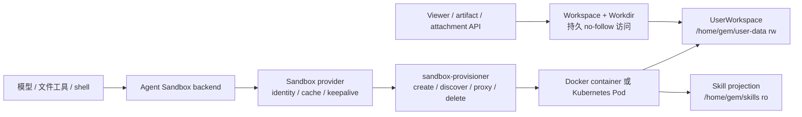

# 沙盒与文件系统机制

本页解释 Agent 的文件和命令如何进入动态沙盒，以及 UserWorkspace、Project Workdir、Skills、Viewer 和 provisioner 的关系。部署参数见[沙盒配置与运维](../agents/sandbox-architecture.md)。

## 一句话理解

Yuxi 让多个访问入口看到同一份持久文件，但给它们不同的访问能力：

- Agent 通过带认证的 provisioner 代理访问动态 Sandbox；
- Viewer、附件和 artifact API 直接访问 UserWorkspace 的持久文件；
- 知识库通过知识库工具访问，不挂载为沙盒目录。

模型和产品接口只使用虚拟路径。宿主机路径、容器路径和对象存储 URL 不能混用；每个文件入口都在所属文件系统边界内校验路径、用户和权限。

## 运行链路

Graph 创建时，Agent backend 取得 `uid`、根运行 scope 和 `workdir_path`，并同步获授权的 Skill 投影。普通聊天与恢复直接进入模型；只有 backend 实际访问文件或执行命令时才创建沙盒。容量不足时工具报告 `sandbox_capacity_exhausted`，不会创建超出资源预算的实例。API/worker 只持有 provisioner 代理地址，不直接访问动态容器或 NodePort。

## Identity、Workdir 和生命周期

`runtime_scope_id` 是一次顶层执行树的沙盒分组键，当前使用根 Conversation 的 thread ID。根 Agent 和子 Agent 共享这个 scope，因此可以共享同一个运行时、`/tmp`、环境和文件挂载；子 Agent 的 child thread 只隔离 LangGraph checkpoint。

Conversation 通过 `project_id` 绑定 Project；Project 拥有这项绑定和 `workdir_path`，UserWorkspace 拥有该路径下的实际文件字节。`workdir_path` 是当前用户 UserWorkspace 下的合法相对 POSIX 路径，不能包含 `..`、反斜杠或符号链接。`linked` Project 只能引用已经存在的目录，目标不存在时请求失败。新 `managed` Project 使用上海时间和 Project ID 前 8 位分配 `projects/YYYY-MM-DD_HH-MM-SS_<project-id-prefix>`；同名条目已经存在时依次追加 `-1`、`-2`，既有 `projects/<uuid>` 保持有效，目录创建失败时请求失败。Workdir 决定当前工作目录和 Viewer 文件范围，但不决定 sandbox identity，也不把同一用户的其他 Project 变成安全隔离边界。两个顶层 Conversation 即使绑定同一 Workdir，也会创建不同 runtime。

| 运行类型 | checkpoint | runtime scope | Workdir |
| --- | --- | --- | --- |
| 普通 Agent | 当前 thread | 根 thread | 当前 Project 的 Workdir |
| 子 Agent | child thread | 根 thread | 继承根 Conversation |
| 远程 Skill 安装 | 临时 thread | 临时 thread | 无持久用户目录，`inherit_env=False` |

`uid + runtime_scope_id` 派生稳定 `sandbox_id`。同一 runtime 存活期间不能改绑到另一个 Workdir。根执行树终态后，worker 清理 runtime，但保留 UserWorkspace 文件。

## 工具审批与历史 PI 结果

普通 Agent 使用文件工具和 `execute`，需要批准的调用通过工具审批恢复。普通 SubAgent 继承父运行的审批模式：`default` 下不能调用写文件、编辑和命令工具；`always_trust` 下可以使用这些工具。SubAgent 的独立 Run、checkpoint 和结果继续由既有子智能体服务持久化。

历史 PI child Run、对话、用量和已交付文件保留原有读取权限，并通过 Run 结果、子任务详情和 Viewer/artifact 下载入口查看。PI child 对话只读，新增请求和恢复均被后端拒绝。升级迁移收敛未结束的 PI Run；部署前必须停止旧 worker 和仍执行 PI 的沙箱，具体取舍见[PI 退役决策](../develop-guides/decisions/implemented/2026-09-18-retire-pi-executor.md)。

## 挂载和文件 Owner

| 虚拟路径 | 内容 | Agent 权限 |
| --- | --- | --- |
| `/home/gem/user-data` | 当前用户的整个 UserWorkspace | 读写 |
| `/home/gem/skills` | 当前用户已授权的共享/内置 Skill 投影 | 只读 |
| `/home/gem/user-data/<workdir_path>` | 当前 Project 的工作目录 | 默认 cwd |

`uploads/` 和 `outputs/` 在首次使用时创建。个人 Skill 位于 `/home/gem/user-data/agents/skills/<slug>`，不会复制到共享 projection。

同一用户的 Sandbox 能看到整个 UserWorkspace，所以 Project A 可以读取 Project B。系统提示词要求 Agent 未经用户明确要求不要在当前 Workdir 外写入，但这只是行为约束，不是安全隔离；真正的边界由用户挂载、Workdir ownership 查询和工具路径校验提供。

文件访问使用相对路径和 no-follow 原语，拒绝 `..`、符号链接、特殊文件和跨用户根目录。普通运行服务以 `1000:1000` 访问数据；storage migrator 只在停机迁移中承担一次性 root 文件操作。

## Docker 和 Kubernetes

Docker backend 为每个 runtime 创建独立 bridge 网络，不发布沙盒端口，也不加入应用 `app-network`。网络只连接 provisioner 和对应沙盒；跨网络实际可达性仍取决于宿主 Docker 平台，独立网络名称不构成认证边界。provisioner 复用实例前会检查 uid、Workdir、挂载、网络和执行认证策略。

Kubernetes backend 创建 Pod 和 NodePort Service。Pod 从 User Data PVC 的 `shared/<uid>/workspace` 挂载 `/home/gem/user-data`，从 Skill PVC 的 `skill-projections/<uid>` 只读挂载 `/home/gem/skills`。Pod 默认不自动挂载 ServiceAccount token；具体安全性仍取决于 namespace、PVC、NetworkPolicy 和 ServiceAccount 配置。

`memory` backend 只记录 ID 到 URL 的映射，不创建隔离环境或准备持久目录，不能作为生产隔离承诺。

## 环境变量和信任边界

API/worker 使用 `SANDBOX_PROVISIONER_TOKEN` 调用 provisioner。动态沙盒会收到全局 `sandbox.env` 与当前用户 Agent 环境的合并值，用户值覆盖同名全局值；这些值都可能被沙盒内代码读取和外传。provisioner token、数据库凭据、对象存储管理凭据和云平台管理员密钥不能进入这两类环境。

provisioner 使用管理主密钥和 sandbox_id 派生独立执行密钥，覆盖沙盒的 `SANDBOX_API_KEY` 并清空其他 JWT 认证配置。每个沙盒仅持有自己的执行密钥，不能据此推导另一沙盒的密钥。管理代理和健康检查使用目标沙盒的密钥，主密钥不传给沙盒。Docker 与 Kubernetes 的启动入口将 AIO 网关所有请求设为需要认证，包含静态后缀和带查询参数的下载；不匹配预期认证模板的镜像启动失败。

远程 Skill 安装使用不继承环境变量的一次性 Sandbox，也不挂载持久用户根。Skill 文件是只读的，但其中脚本仍可能被执行；脚本如需写文件，应写入当前 Project Workdir 或 User Data。

## 失败、恢复和观察边界

| 现象 | 能证明什么 | 不能证明什么 |
| --- | --- | --- |
| provisioner `/health` 正常 | 进程和 backend 已初始化 | 某个 runtime 已创建、挂载或权限正确 |
| create/discover 返回代理 URL | 找到 identity 匹配的实例 | Workdir 内容和 Viewer 权限正确 |
| Viewer 读到文件 | API 完成 ownership 和 no-follow 访问 | Agent runtime 当前可用 |
| runtime 被回收 | 动态进程生命周期结束 | 持久文件被删除或内容正确 |
| 迁移器成功 | 迁移目标和路径约束通过回读 | 未来 Agent 行为都正确 |

Viewer 和 Agent 看到不同内容时，先核对同一 `uid`、Conversation 绑定的 `project_id`、Project 的 `workdir_path`、runtime scope、宿主 bind/PVC subPath 和 generation。不要用对象 URL 推断文件系统权限，也不要用相邻 Run 的路径猜测当前结果。

## 源码定位与验证

- [Sandbox provider](https://github.com/xerrors/Yuxi/blob/main/backend/package/yuxi/agents/backends/sandbox/provider.py)：runtime identity、缓存和 keepalive
- [Workspace 路径](https://github.com/xerrors/Yuxi/blob/main/backend/package/yuxi/workspace/paths.py)：uid 与 Workdir 映射
- [Workspace 文件系统](https://github.com/xerrors/Yuxi/blob/main/backend/package/yuxi/workspace/filesystem.py)：宿主 no-follow 文件原语
- [provisioner](https://github.com/xerrors/Yuxi/blob/main/docker/sandbox_provisioner/app.py)：Docker/Kubernetes 创建、代理和回收
- [storage migration](https://github.com/xerrors/Yuxi/blob/main/backend/package/yuxi/storage_migration.py)：历史布局迁移
- [Sandbox backend unit tests](https://github.com/xerrors/Yuxi/tree/main/backend/test/unit/backends)
- [Workspace/Workdir unit tests](https://github.com/xerrors/Yuxi/tree/main/backend/test/unit/workspace)
- [Project Workdir provisioner integration](https://github.com/xerrors/Yuxi/blob/main/backend/test/integration/services/test_project_workdir_provisioner.py)

修改 identity、挂载、路径或清理语义时，除了相关 unit，还要验证真实 Docker/PVC 挂载和最终 POSIX 文件字节。
