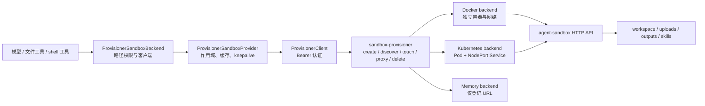

# 沙盒与文件系统机制

本文是面向贡献者和运维人员的机制参考，解释 Agent 文件与命令操作如何从 Yuxi runtime 进入按作用域创建的沙盒，以及虚拟路径、宿主机文件、Skills、Viewer 和 provisioner 之间的关系。环境变量、Docker/Kubernetes 接入步骤和日常排障见[沙盒配置与运维](../agents/sandbox-architecture.md)；Agent 文件工具的使用方法见[中间件系统](../agents/middleware.md)。

## 体系分层

Yuxi 沙盒由三个协作层组成：

1. Agent backend 决定模型能读、写、搜索和执行哪些虚拟路径，并为每次操作获取沙盒客户端。
2. `sandbox-provisioner` 以 `sandbox_id` 创建、发现、代理和回收一个实际执行实例；当前应用层只支持 `SANDBOX_PROVIDER=provisioner`。
3. provisioner backend 决定实例由本机 Docker 容器、Kubernetes Pod/Service，还是仅供测试的 memory 记录承载。

模型和产品接口统一使用虚拟路径。宿主机 `saves/threads/...`、Docker bind mount 和 Kubernetes PVC subPath 承担底层存储。所属文件系统在边界处将用户输入解析到允许的宿主机根，并拒绝对象 URL、容器路径和本地绝对路径之间的混用。

## 运行链路

Graph 构建时，文件系统中间件创建 `ProvisionerSandboxBackend`。真实实例采用惰性获取：第一次文件或命令操作调用 `_get_client()`，provider 随后按当前作用域执行 `get(create_if_missing=True)`。API/worker 收到需要同一 Bearer token 的 `/api/sandboxes/<id>/proxy`；容器或 NodePort 原始地址只供 provisioner 访问。

Viewer、artifact 下载和部分附件接口无需冷启动沙盒。授权通过后，这些入口使用宿主机路径解析或只读 backend 访问同一批持久目录。页面能够列出文件时，可以确认 Viewer 路径存在；沙盒实例及其挂载状态仍需单独验证。

## 身份、作用域与生命周期

沙盒 identity 由 `uid`、`file_thread_id` 和 `skills_thread_id` 共同决定。provider 将三者组成缓存 key，并对身份文本做 SHA-256 后取前 12 位作为稳定 `sandbox_id`；相同作用域可发现或复用实例，不同用户即使 thread ID 相同也得到不同 identity。

| 运行类型 | checkpoint `thread_id` | `file_thread_id` | `skills_thread_id` | 结果 |
|---|---|---|---|---|
| 普通 Agent | 当前对话 | 当前对话 | 当前对话 | 对话附件/产物与该 Agent 的 Skills 同作用域 |
| 子智能体 | child thread | 父对话文件线程 | child thread | 共享父对话 uploads/outputs，使用子 Agent 自己的 Skills 投影 |
| 远程 Skill 拉取等隔离动作 | 专用临时值 | 专用临时值 | 专用临时值 | `inherit_env=False`，不继承全局和用户 Agent 环境变量 |

provider 对同一缓存 key 使用弱引用锁串行 create/discover，并缓存返回的代理 URL。到达 keepalive 间隔后执行 `touch`；provisioner 的 idle reaper 根据最近 touch 时间删除空闲实例。配置的 idle timeout 若不大于命令超时，会提高到“命令超时 + 30 秒”，避免按配置主动回收仍可能执行的命令。API/worker 关闭时 provider 尝试删除其缓存的实例；删除失败会记录日志，不能据此推断底层资源已经消失。

## 虚拟命名空间与文件 Owner

Agent 文件 backend 只允许读取 `/home/gem/user-data` 与 `/home/gem/skills` 下的路径；列目录时可以从共同父级进入这两个根。写操作仅开放 `workspace` 和 `outputs`。shell 命令受 sandbox 容器挂载权限约束，当前 uploads 以 `rw` 挂载；文件工具的只读策略不构成进程级只读隔离。

| 虚拟路径 | 宿主机或共享卷 Owner | Agent 权限 | 生命周期与用途 |
|---|---|---|---|
| `/home/gem/user-data/workspace` | `saves/threads/shared/<safe_uid>/workspace` | 读写 | 同一用户跨线程共享；保存中间文件、个人 Skills 与 Agent 上下文文件 |
| `/home/gem/user-data/uploads` | `saves/threads/<file_thread_id>/user-data/uploads` | 文件工具只读；sandbox 挂载可写 | 线程附件和解析副本；正常写入 Owner 是上传/附件服务 |
| `/home/gem/user-data/outputs` | `saves/threads/<file_thread_id>/user-data/outputs` | 读写 | 用户可见产物、长工具结果与对话历史 offload |
| `/home/gem/skills` | `saves/threads/<skills_thread_id>/skills` | 只读 | 当前运行可读的共享/内置 Skill 投影 |

普通安全 UID 原样作为目录名；包含 `:` 等不安全字符的身份只在文件系统边界转换为 `uid-<sha256>`，数据库和业务身份保持原值。`resolve_virtual_path()` 先检查配置的 user-data 前缀，再按首级命名空间选择真实根，最后在解析符号链接和 `..` 后通过 `ensure_within_root` 拒绝逃逸。

知识库没有 `/home/gem/kbs` 映射。Agent 通过 knowledge-base Skill 的检索、打开、定位和下载工具访问；只有 `download_kb_file` 明确把原始二进制写入当前文件线程的 `outputs`，再返回沙盒虚拟路径。

## Docker 与 Kubernetes 承载

Docker backend 为每个 sandbox 创建独立 bridge 网络，只连接 provisioner 容器与对应 sandbox；sandbox 不加入承载 PostgreSQL、Redis、MinIO 和 API/worker 的应用网络，端口也不发布到宿主机。provisioner 通过动态容器名访问内部端口，并向调用方暴露认证代理 URL。实例创建时分别 bind mount workspace、uploads、outputs 和只读 skills；`/home/gem` 使用可执行 tmpfs 满足镜像启动要求，持久数据只来自显式挂载。

Kubernetes backend 在配置 namespace 中创建同名 Pod 与 NodePort Service。Pod 从 `THREAD_PVC` 的不同 subPath 挂载四个目录，`/home/gem` 使用 `emptyDir`；`SKILLS_PVC` 当前被读取但没有进入 Pod volume spec，不构成实际数据 Owner。`NODE_HOST` 与 NodePort 必须从 provisioner 可达，因为实际探活和代理流量由 provisioner 发起，API/worker 仍只访问 provisioner 代理。

Kubernetes Pod 设置 `automount_service_account_token=False`，避免 sandbox 自动获得集群凭据。Docker 与 Kubernetes 都校验已发现实例的 uid、file/skills thread 和挂载是否匹配当前请求；不匹配的旧实例会被删除并重建，不能仅凭相同 `sandbox_id` 复用不符合当前身份与挂载的资源。

Memory backend 只保存 `sandbox_id → URL` 记录，不创建隔离环境、不准备目录，也不证明目标 URL 存在；它只适合测试或由外部固定 sandbox 提供执行面的场景，不能作为生产隔离承诺。

## 环境变量与信任边界

API/worker 使用 `SANDBOX_PROVISIONER_TOKEN` 调用 provisioner 的管理与代理接口。token 至少 32 个字符，必须与 JWT、API Key 派生密钥等其他 secret 独立；它只属于 API、worker 和 provisioner，绝不能进入全局 `sandbox.env`、用户 Agent 环境变量或模型上下文，否则不可信 sandbox 将重新获得创建、代理和删除其他实例的管理能力。

动态 sandbox 默认接收两组运行环境：`docker/sandbox_provisioner/sandbox.env` 中的全局项，以及 PostgreSQL `agent_envs` 中当前 uid 的用户项；用户项同名覆盖全局项。它们都对 sandbox 内执行的任意代码可见，因此只能保存明确允许任务代码读取的值，不应承载数据库、provisioner、对象存储或集群管理凭据。远程 Skill 拉取等不可信复制流程传入 `inherit_env=False`，两组环境都不会注入。

provisioner HTTP client 禁用环境代理继承并限制转发 hop-by-hop 头；代理响应只保留允许的内容与缓存相关头。这个代理边界隐藏了底层地址但不替代 sandbox 自身认证、容器/PVC 权限和网络隔离，任何一层配置错误都必须显式失败或产生可观察日志，不能回退为 API 进程本地执行。

## 失败、恢复与观察边界

| 现象 | 首要 Owner / 观察点 | 不能据此推断 |
|---|---|---|
| `/health` 返回 backend 与 idle 配置 | provisioner 进程与 backend 初始化 | 某个 thread sandbox 已创建、挂载或可执行 |
| create/discover 返回代理 URL | provisioner 已找到身份匹配实例 | 文件内容正确、用户有 Viewer 权限 |
| Viewer 能列出文件 | 宿主机路径解析与 Viewer 授权成功 | sandbox 进程可见相同挂载或 shell 成功 |
| 文件工具返回 permission denied | `ProvisionerSandboxBackend` 虚拟路径策略拒绝 | 容器 mount 本身只读；shell 仍需单独判断 |
| sandbox 探活失败 | Docker/Kubernetes 实例、网络、镜像或端口 | PostgreSQL/Redis 等应用依赖异常 |
| idle reaper 删除日志 | provisioner 已调用 backend delete | 外部删除绝对成功；失败会记录 warning 并保留待观察资源 |

缓存中的实例 touch 异常时，provider 当前记录 warning 并返回既有 `sandbox_id`；随后真正文件操作仍可能因代理或实例不可达失败。排障必须分别检查 identity、provisioner proxy、底层实例、挂载源和虚拟路径解析，不能把一次健康检查或日志关键词当成整条链路通过。

沙盒内容的持久性来自显式 workspace/uploads/outputs/skills 挂载，不来自容器本身。idle 回收或实例重建后，挂载数据应继续存在；`/home/gem` 其他内容属于 tmpfs/emptyDir，不能作为可恢复业务产物。

## 源码定位与验证

- 应用层 identity、缓存、keepalive 与生命周期：[sandbox/provider.py](https://github.com/xerrors/Yuxi/blob/main/backend/package/yuxi/agents/backends/sandbox/provider.py)
- 虚拟路径到宿主机路径的校验与映射：[sandbox/paths.py](https://github.com/xerrors/Yuxi/blob/main/backend/package/yuxi/agents/backends/sandbox/paths.py)
- 文件 backend 的读写根、命令和 provisioner proxy client：[sandbox/backend.py](https://github.com/xerrors/Yuxi/blob/main/backend/package/yuxi/agents/backends/sandbox/backend.py)
- Docker/Kubernetes/Memory backend、认证代理与 idle reaper：[sandbox_provisioner/app.py](https://github.com/xerrors/Yuxi/blob/main/docker/sandbox_provisioner/app.py)
- 用户侧 Viewer 投影：[viewer_filesystem_service.py](https://github.com/xerrors/Yuxi/blob/main/backend/package/yuxi/services/viewer_filesystem_service.py)
- 运行配置与默认值：[docker-compose.yml](https://github.com/xerrors/Yuxi/blob/main/docker-compose.yml) 和 [docker-compose.prod.yml](https://github.com/xerrors/Yuxi/blob/main/docker-compose.prod.yml)

最小行为证据位于 `backend/test/unit/backends/test_sandbox_*`、`backend/test/unit/services/test_viewer_filesystem_service.py` 及 sandbox/viewer 相关 E2E。路径、挂载、身份或回收语义发生变化时，需要补充真实 Docker 和文件副作用验证，并沿文件工具或 Viewer 的完整装配链核对最终文件与隔离结果。
